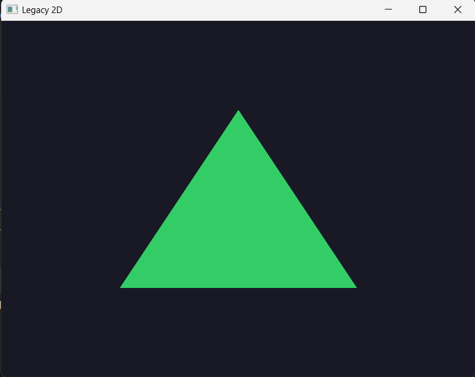
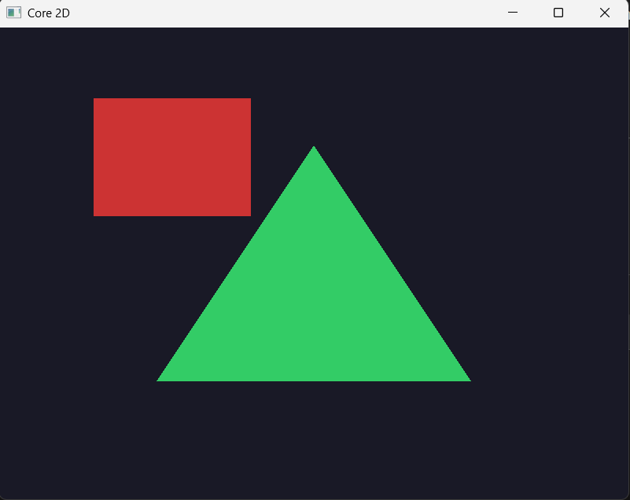
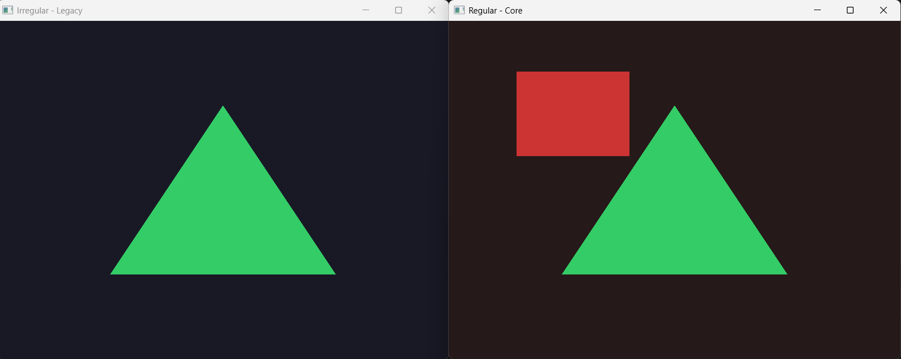

# cg-prueba — Motor de Polígonos 2D/3D en OpenGL

Proyecto de computación gráfica en C++20 con OpenGL, GLFW y GLAD.  
Implementa una jerarquía de polígonos con soporte para renderizado **Legacy (OpenGL 2.1)** y **Core Profile (OpenGL 4.6)**, transformaciones 3D y rotación interactiva con el mouse.

---

## Demos

| Demo | Descripción |
|------|-------------|
|  | **Legacy** — polígonos con `glBegin/glEnd` |
|  | **Core** — polígonos con shaders GLSL |
|  | **Dual** — ventana legacy + core simultáneas |
|  | **3D Rotación** — arrastrar con mouse para rotar |

---

## Arquitectura

### Jerarquía de Polígonos

```
Poligono  (abstracta)
├── PoligonoRegular      → area = perimetro * apotema / 2
│                          perimetro = n * lado
└── PoligonoIrregular    → area por Shoelace
    └── Triangulo        → garantiza exactamente 3 vértices

PoligonoFactory::crear(vector<Punto>)
    → detecta automáticamente Regular o Irregular
    → devuelve unique_ptr<Poligono>
```

### Jerarquía de Ventanas

```
Ventana  (abstracta — GLFW, input, swap buffers)
├── VentanaLegacy  → contexto OpenGL 2.1, glBegin/glEnd
└── VentanaCore    → contexto OpenGL 4.6, shaders, VAO, VBO
```

### Otras clases

| Clase | Responsabilidad |
|-------|----------------|
| `Punto` | Coordenada 2D/3D (Z=0 si 2D) |
| `Shader` | Compilar, enlazar y usar shaders GLSL |
| `Camara` | Matrices view/projection, mouse, selección y rotación de polígonos |

---

## Estructura del Proyecto

```
cg-prueba/
├── include/               Headers de todas las clases
├── src/
│   ├── main.cpp           Demo 3D con rotación por mouse
│   ├── main_core.cpp      Demo Core Profile
│   ├── main_legacy.cpp    Demo Legacy
│   ├── main_dual.cpp      Demo dual ventana
│   └── *.cpp              Implementaciones
├── test/
│   ├── Punto/
│   ├── Poligono/
│   ├── PoligonoIrregular/
│   ├── PoligonoRegular/
│   ├── PoligonoFactory/
│   └── Triangulo/
├── external/
│   └── glad/              Loader de OpenGL
└── CMakeLists.txt
```

---

## Requisitos

- **MSYS2** con toolchain UCRT64
- **CMake** >= 3.20
- **C++20**

Instalar dependencias:

```bash
pacman -S mingw-w64-ucrt-x86_64-toolchain
pacman -S mingw-w64-ucrt-x86_64-cmake
pacman -S mingw-w64-ucrt-x86_64-glfw
pacman -S mingw-w64-ucrt-x86_64-glm
pacman -S mingw-w64-ucrt-x86_64-gtest
```

---

## Compilar

```bash
cmake -B cmake-build-debug -G Ninja
cmake --build cmake-build-debug
```

### Ejecutables disponibles

| Target | Descripción |
|--------|-------------|
| `cg_prueba` | Demo 3D con rotación por mouse |
| `core_app` | Demo Core Profile 2D |
| `legacy_app` | Demo Legacy 2D |
| `dual_app` | Dos ventanas simultáneas |

---

## Tests

```bash
cd cmake-build-debug
ctest --extra-verbose
```

| Suite | Tests |
|-------|-------|
| `TestPunto` | Constructor 2D/3D, print |
| `TestPoligono` | Polimorfismo, getVertices |
| `TestPoligonoIrregular` | Área Shoelace, perímetro |
| `TestPoligonoRegular` | Apotema, área, lado |
| `TestPoligonoFactory` | Detección regular/irregular, validación |
| `TestTriangulo` | Área, perímetro, vértices |

---

## Uso

### Crear polígonos con la Factory

```cpp
// La factory detecta automáticamente si es regular o irregular
auto triangulo = PoligonoFactory::crear({
    Punto( 0.0f,  0.5f, 0.0f),
    Punto(-0.5f, -0.5f, 0.0f),
    Punto( 0.5f, -0.5f, 0.0f)
});

auto cuadrado = PoligonoFactory::crear({
    Punto(-0.5f,  0.5f, 0.0f),
    Punto( 0.5f,  0.5f, 0.0f),
    Punto( 0.5f, -0.5f, 0.0f),
    Punto(-0.5f, -0.5f, 0.0f)
});
```

### Transformaciones

```cpp
poligono->setPosicion(0.5f, 0.f, 0.f);
poligono->setRotacion(45.f, 0.f, 0.f);  // X, Y, Z en grados
poligono->setEscala(0.5f, 0.5f, 1.f);
```

### Rotación interactiva con mouse

```cpp
Camara camara(800.f, 600.f);
camara.agregarPoligono(poligono.get());

glfwSetCursorPosCallback(ventana.getVentana(), Camara::callbackMouse);
glfwSetScrollCallback(ventana.getVentana(),    Camara::callbackScroll);

// Click izquierdo + arrastrar sobre un polígono → lo rota en 3D
```

---

## Limitaciones

Este motor está diseñado para **polígonos planos** (2D y 3D planos).  
Para poliedros (cubos, esferas, pirámides) se necesitaría extender con:
- Caras indexadas (EBO)
- Normales por vértice
- Iluminación (Phong/Blinn)

---

## Autor

Diego — 2026