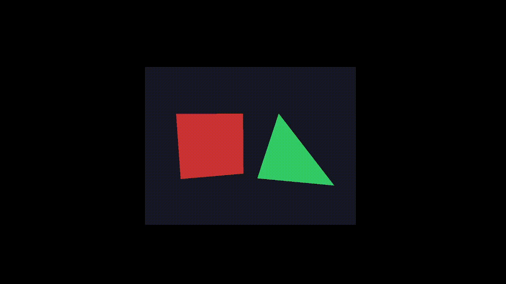
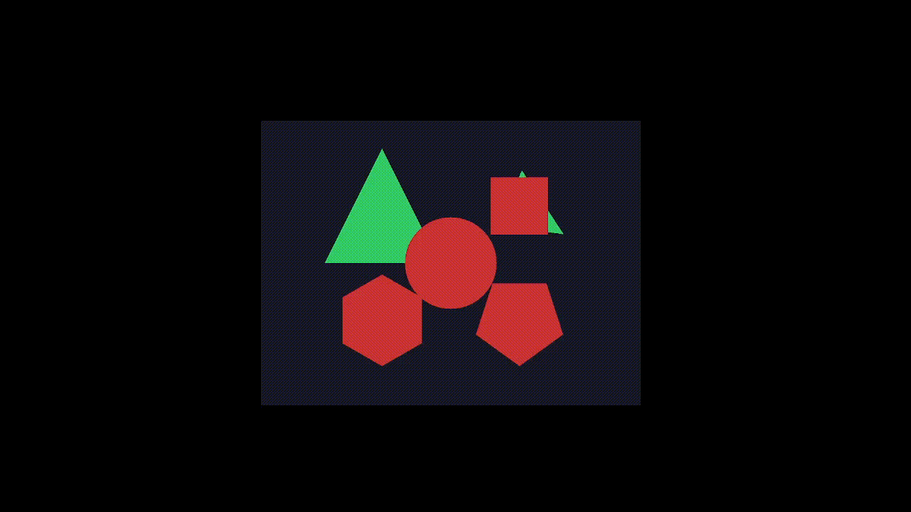

# cg-prueba — Motor de Polígonos 2D/3D en OpenGL

Proyecto de computación gráfica en C++20 con OpenGL, GLFW y GLAD.  
Implementa una jerarquía de polígonos con soporte para renderizado **Legacy (OpenGL 2.1)** y **Core Profile (OpenGL 4.6)**, transformaciones 3D y rotación interactiva con el mouse.

---

## Demos

| Demo                                   | Descripción                                                                           |
|----------------------------------------|---------------------------------------------------------------------------------------|
|    | **Legacy** — polígonos con `glBegin/glEnd`                                            |
|        | **Core** — polígonos con shaders GLSL                                                 |
|        | **Dual** — ventana legacy + core simultáneas                                          |
|   | **3D Rotación** — arrastrar con mouse para rotar                                      |
|  | **Helpers** — triángulo (regular e irregular), cuadrado, hexágono, pentágono, círculo |


## Arquitectura

### Jerarquía de Polígonos

```
Poligono  (abstracta)
├── PoligonoRegular      → area = perimetro * apotema / 2
│                          perimetro = n * lado
└── PoligonoIrregular    → area por Shoelace
    └── Triangulo        → garantiza exactamente 3 vértices
```

`PoligonoFactory` es el punto de entrada para crear cualquier tipo de polígono — tanto regulares (todos los lados iguales) como irregulares. Detecta automáticamente el tipo según los vértices y devuelve un `unique_ptr<Poligono>`, liberando la memoria automáticamente al salir de scope.

```c++
PoligonoFactory::crear(vector<Punto>)                    → detecta Regular o Irregular
PoligonoFactory::crearTriangulo(p1, p2, p3)              → triángulo con 3 puntos
PoligonoFactory::crearCuadrado(cx, cy, lado)             → cuadrado centrado
PoligonoFactory::crearPoligonoRegular(n, cx, cy, radio)  → polígono regular de N lados
```

### Jerarquía de Ventanas

```
Ventana  (abstracta — GLFW, input, swap buffers)
├── VentanaLegacy  → contexto OpenGL 2.1, glBegin/glEnd
└── VentanaCore    → contexto OpenGL 4.6, shaders, VAO, VBO
```

### Otras clases

| Clase | Responsabilidad |
|-------|----------------|
| `Punto` | Coordenada 2D (Z=0 automático) o 3D |
| `Shader` | Compilar, enlazar y usar shaders GLSL |
| `Camara` | Matrices view/projection, callbacks de mouse, selección y rotación de polígonos |

---

## Estructura del Proyecto

```
cg-prueba/
├── include/
│   ├── Camara.h
│   ├── Poligono.h
│   ├── PoligonoFactory.h
│   ├── PoligonoIrregular.h
│   ├── PoligonoRegular.h
│   ├── Punto.h
│   ├── Shader.h
│   ├── Triangulo.h
│   ├── Ventana.h
│   ├── VentanaCore.h
│   └── VentanaLegacy.h
├── src/
│   ├── main.cpp           Demo 3D con rotación por mouse
│   ├── main_core.cpp      Demo Core Profile 2D
│   ├── main_legacy.cpp    Demo Legacy 2D
│   ├── main_dual.cpp      Dos ventanas simultáneas
│   ├── main_helpers.cpp   Demo helpers de la factory
│   └── *.cpp              Implementaciones
├── test/
│   ├── Punto/
│   ├── Poligono/
│   ├── PoligonoIrregular/
│   ├── PoligonoRegular/
│   ├── PoligonoFactory/
│   └── Triangulo/
├── external/
│   └── glad/
├── docs/
│   ├── demo_legacy.png
│   ├── demo_core.png
│   ├── demo_dual.png
│   ├── demo_helpers.png
│   └── demo_3d_rotacion.gif
└── CMakeLists.txt
```

---

## Requisitos

- **MSYS2** con toolchain UCRT64
- **CMake** >= 3.20
- **C++20**

Instalar dependencias:

```bash
pacman -S mingw-w64-ucrt-x86_64-toolchain
pacman -S mingw-w64-ucrt-x86_64-cmake
pacman -S mingw-w64-ucrt-x86_64-glfw
pacman -S mingw-w64-ucrt-x86_64-glm
pacman -S mingw-w64-ucrt-x86_64-gtest
```

---

## Compilar y ejecutar sin IDE

```bash
# clonar
git clone https://github.com/tu-usuario/cg-prueba.git
cd cg-prueba

# configurar
cmake -B cmake-build-debug -G Ninja -DCMAKE_BUILD_TYPE=Debug

# compilar todo
cmake --build cmake-build-debug

# compilar un target específico
cmake --build cmake-build-debug --target cg_prueba
```

### Ejecutables disponibles

| Target | Comando | Descripción |
|--------|---------|-------------|
| `cg_prueba` | `./cmake-build-debug/cg_prueba.exe` | Demo 3D con rotación por mouse |
| `core_app` | `./cmake-build-debug/core_app.exe` | Demo Core Profile 2D |
| `legacy_app` | `./cmake-build-debug/legacy_app.exe` | Demo Legacy 2D (sin shaders) |
| `dual_app` | `./cmake-build-debug/dual_app.exe` | Dos ventanas simultáneas |
| `helpers_app` | `./cmake-build-debug/helpers_app.exe` | Demo helpers de la factory |

---

## Tests

```bash
cd cmake-build-debug
ctest --extra-verbose
```

| Suite | Tests |
|-------|-------|
| `TestPunto` | Constructor 2D/3D, print |
| `TestPoligono` | Polimorfismo, getVertices |
| `TestPoligonoIrregular` | Área Shoelace, perímetro |
| `TestPoligonoRegular` | Apotema, área, lado |
| `TestPoligonoFactory` | Detección regular/irregular, validación |
| `TestTriangulo` | Área, perímetro, vértices |

---

## Uso

### Crear polígonos con la Factory

```cpp
// detecta automáticamente regular o irregular
auto poligono = PoligonoFactory::crear({
    Punto( 0.0f,  0.5f, 0.0f),
    Punto(-0.5f, -0.5f, 0.0f),
    Punto( 0.5f, -0.5f, 0.0f)
});

// helpers para formas comunes
auto triangulo = PoligonoFactory::crearTriangulo(p1, p2, p3);
auto cuadrado  = PoligonoFactory::crearCuadrado(0.f, 0.f, 0.5f);
auto hexagono  = PoligonoFactory::crearPoligonoRegular(6, 0.f, 0.f, 0.4f);
auto pentagono = PoligonoFactory::crearPoligonoRegular(5, 0.f, 0.f, 0.4f);
```

### Transformaciones

```cpp
poligono->setPosicion(0.5f, 0.f, 0.f);
poligono->setRotacion(45.f, 0.f, 0.f);  // X, Y, Z en grados
poligono->setEscala(0.5f, 0.5f, 1.f);
```

### Rotación interactiva con mouse (Core)

```cpp
Camara camara(800.f, 600.f);
camara.agregarPoligono(poligono.get());

glfwSetCursorPosCallback(ventana.getVentana(), Camara::callbackMouse);
glfwSetScrollCallback(ventana.getVentana(),    Camara::callbackScroll);

// click izquierdo + arrastrar sobre un polígono → lo rota en 3D
// scroll → zoom
```

---

## Limitaciones

Este motor está diseñado para **polígonos planos** (2D y 3D planos).  
Para poliedros (cubos, esferas, pirámides) se necesitaría extender con:
- Caras indexadas (EBO)
- Normales por vértice
- Iluminación (Phong/Blinn)

`VentanaLegacy` no soporta shaders ni matrices de transformación — solo dibuja polígonos en posición fija con `glBegin/glEnd`.

La detección de click sobre un polígono (`contienePunto`) 
funciona en espacio NDC (-1 a 1). Los vértices deben definirse cerca 
del origen y usar `setPosicion` para ubicar los vértices fuera del rango NDC no serán detectados correctamente. Polígonos muy solapados entre sí también pueden dificultar la selección.
---

## Autor

Diego Rivas — 2026